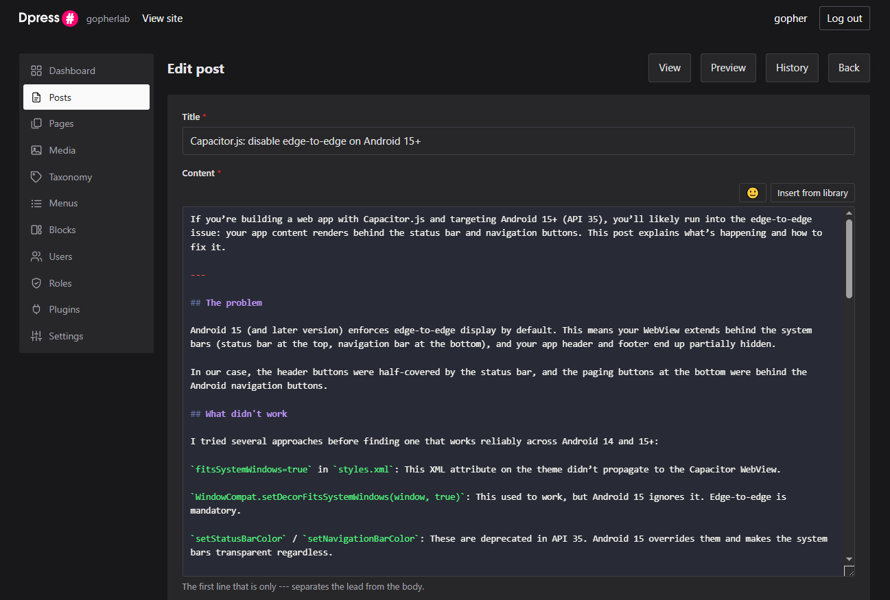

# Dpress

A markdown based CMS built on [dynart-micro](https://github.com/goph-R/dynart-micro) and
[dynart-micro-entities](https://github.com/goph-R/dynart-micro-entities). PHP 8.0+, MariaDB, MIT.

It is for a site somebody writes rather than assembles: **the markdown is the truth**, the pages
are rendered when they are saved, and a page view is a handful of queries and no build step. The
front end ships **no JavaScript** — a page loads a script only if there is something on it that
needs one, a code block or a plugin's widget.

Status: **0.70.0**, feature complete and pre-1.0. Everything below is built. What 1.0 is waiting
on is the schema settling down — until then a schema change means dropping and recreating the
database, and there are no rename migrations.



## What it does

**Writing.** Markdown, in a textarea that is deliberately not a WYSIWYG editor — a field whose
value is anything other than what the author typed eventually rewrites somebody's document on
save. It is coloured rather than replaced: a highlighted backdrop sits behind the real field, so
the value, the selection and the undo stack are untouched. Two buttons are all that is left, for
the two things a keyboard cannot do — inserting from the media library, which needs an id nobody
memorises, and picking an emoji.

- The first line that is only `---` splits the **lead** from the body; every one after that is a
  **page break**, so a long post is served a page at a time with *Previous* and *Next*
  ([pages-in-content.md](docs/pages-in-content.md)).
- **Internal links say what they point at, never where it is**: `media#12`, `post#42`, `page#5`,
  `category#21`, `tag#7` resolve at render time, so renaming a page moves every link to it
  ([internal-links.md](docs/internal-links.md)).
- **Callouts** — `> [!WARNING]` is a coloured panel, and still a plain blockquote anywhere without
  Dpress ([callouts.md](docs/callouts.md)).
- **Shortcodes** — `{{ video('media#10') }}`, parsed as CommonMark inline syntax, so one inside a
  code fence is left alone ([shortcodes.md](docs/shortcodes.md)).
- **Syntax highlighting**, in the browser rather than in the stored HTML, so changing the theme
  re-colours every post and touches no document ([code-highlighting.md](docs/code-highlighting.md)).
- Tables, bare URLs linked in prose but not in code, and a full **revision history** on every save.

**The site.** Posts and pages in one table; pages nest and live at their own paths, posts live at
`/post/<slug>` or `/<slug>` depending on a setting, with the other shape 301ing to it. Categories
are a tree, tags are flat, and a `featured` tag pins a strip to the front page. There is a
`/feed`, a `/sitemap.xml`, dates in the site's own timezone, and a media library with lazy
thumbnails and SVGs sanitised on the way in.

**Themes and blocks.** A theme is [a folder with a `theme.ini` in it](docs/themes.md) — dropping
it in installs it, and which one renders is a setting. A theme may have a layout per kind of page
(`home`, `archive`, `post`, `page`, `auth`) and having the file is the whole registration. A
[block](docs/blocks.md) is something in a place beside the content — a tag cloud, a category list,
a piece of markdown — and a **menu** is assigned to the same places, its items storing a target
rather than a URL so a rename moves them.

**Who may do what.** Users, roles and plain-string permissions, JWT in cookies with rotating
refresh tokens, rate limiting on every way in, and a site that refuses to let you remove its last
administrator. Deleting a user never deletes what they wrote.

**Extending it.** [Plugins](docs/plugins.md) are a folder under `plugins/` with a `plugin.ini`,
enabled through a setting. Every form and every query is built by a factory that emits an event,
so a plugin can add a field or narrow a listing without a fork; permissions, block types,
shortcodes, field widgets, entities and migrations are all registrations. Three exist —
[disqus](https://github.com/goph-R/dynart-dpress-disqus),
[kofi](https://github.com/goph-R/dynart-dpress-kofi) and
[fontawesome](https://github.com/goph-R/dynart-dpress-fontawesome) — and the Ko-fi one used to be
in core, which is the test of whether the extension points are real.

**How fast.** On a contended shared VPS, the same content on the same machine: **~43 ms of server
time against WordPress's ~568 ms**, about 13×, with no caching plugin on either side. About 95% of
that 43 ms is boot; the page's own work is a couple of milliseconds.
[performance.md](docs/performance.md) is how to measure it yourself rather than take that on trust.

## Requirements

- PHP 8.0+, with `mbstring`, `json`, `pdo`, `dom`, `libxml` and `gd`
- MariaDB / MySQL
- Composer

## Installing a site

A site is a directory containing a `dpress.ini`. The `dpress` command finds it by walking up from
the working directory, the way git finds its root, so the command works from anywhere inside the
project.

```bash
composer install

vendor/bin/dpress init \
    -base-url https://example.com \
    -db-name mysite -db-user mysite -db-password 'from your database' \
    -site-name "My Site"

# create the database itself, which Dpress does not do:
#   create database `mysite` character set utf8mb4 collate utf8mb4_unicode_ci;

vendor/bin/dpress install
vendor/bin/dpress user:create -email you@example.com -name "You" -role admin
vendor/bin/dpress doctor
```

`init` writes the `dpress.ini` and **generates the signing secret**, which was the fiddliest step
and the one where getting it wrong is invisible: a config copied from an example and never edited
signs every session on the site with a value that is in a public repository.

Add **`-dev`** for a development site. It changes three settings that go together and are each a
separate way to lose an afternoon: `app.environment = dev` shows the error instead of hiding it,
`jwt.cookie_secure = false` lets a plain HTTP site log in at all, and `mail.mailer = log` writes
mail into `logs/` instead of sending it.

`user:create` **generates a password when `-password` is left off** and prints it once, which
keeps the first admin's password out of your shell history.

Point the web server's DocumentRoot at **`public/`**, never at the project root: `dpress.ini` holds
the database password and the signing secret, and publishing the root serves them.

`doctor` is the last step because it is the one that answers whether the rest worked. It checks
what a browser will not tell you — a log directory inside the document root, `uploads/` with no
`.htaccess`, a database that cannot hold an emoji.

## Moving a site to production

The content survives the move; **the stored HTML has the old address baked into it**, and that is
the one thing worth knowing before you do it.

Internal links are resolved when a document is saved, not when a page is served — that is what
makes a page view free — and `Router::url()` prefixes `app.base_url`. So `body_html` holds
absolute URLs, and a database restored under a new domain keeps pointing at the machine it was
written on. Nothing errors: the front page renders, the theme is right, and the first link a
reader clicks leaves the site.

```bash
# on the old machine
vendor/bin/dpress export -to ./bundle
tar czf bundle.tgz bundle

# on the new one, after composer install and a dpress.ini with the new app.base_url
tar xzf bundle.tgz
vendor/bin/dpress import -from ./bundle -confirm
vendor/bin/dpress doctor
```

`import` creates the schema if it is not there, loads the rows, copies the uploads and then
**re-renders every stored document for this site's address** — not offered, not suggested, done.
A step that can be forgotten in that position is a step that will be.

### What is in a bundle

```
bundle/
  site.json          version, address, theme, plugins, row counts
  data/<table>.json  the rows
  uploads/           the files
```

**Data, not schema.** The new server builds its tables from its own migrations and the bundle only
carries rows, so the schema that ends up there is the one that server's Dpress believes in rather
than a snapshot of the old one's. It also means no `mysqldump` to have installed and on `PATH`.

**A folder, not an archive**, because `tar` and `zip` both exist already and neither has to become
a PHP extension this package requires.

**`dpress.ini` is not in it.** It holds the database password and the signing secret, and every
value in it describes the machine rather than the site.

**Sessions do not travel** — `refresh_token`, `user_token` and `auth_attempt` are left out for the
same reason they are not audited: they hold credentials and are short-lived, and a bundle is as
durable as an artifact gets. Everybody signs in again on the new server, which is the right
outcome.

Export and import want **the same Dpress version** on both sides; `import` says so and takes
`-force` if you know the difference is safe.

### After an import

`doctor` is how you find out what is left, and the checks it runs are the ones a page view will
not tell you about:

```
X   Rendered for    https://old.example.com, but this site is https://example.com
        Run `dpress content:rerender`. Every stored link still points at the old address,
        and nothing on the site will say so.
```

Two things a bundle cannot bring with it, both named by `doctor`:

- **Plugin code.** The enabled list travels in `dp_setting`; the clones do not, and a plugin that
  is enabled with nothing on disk is **skipped silently** — the site works and one feature is
  gone. A plugin's own *table* is also made only when the plugin is loaded, and the list of
  enabled plugins arrives with the import — so clone the missing ones and **run the import once
  more**, and the second pass boots with them on and loads their rows.
- **The theme.** A theme that is set but not installed leaves the site rendering the built-in
  templates, which looks deliberate.

## The `dpress` command

`-config <path>` points at a specific `dpress.ini` instead of searching for one. `init`, `help` and
`version` work outside a site — `init` is what makes one — and everything else needs a config.
`dpress help` prints the same list, out of the same table the commands are declared in.

### The site

| Command | What it does |
|---|---|
| `dpress init -base-url … -db-name … -db-user …` | Write a `dpress.ini` here, with a generated signing secret |
| `dpress install` | Create the database schema and apply every migration |
| `dpress upgrade` | Apply the pending migrations |
| `dpress migrate:status` | List the applied and the pending migrations |
| `dpress doctor` | Check everything an install or a move can get silently wrong |
| `dpress export -to <dir>` | Write the content, the uploads and the manifest to a folder |
| `dpress import -from <dir> -confirm` | Replace this site with a bundle, and re-render it here |
| `dpress version` / `dpress help` | Print the version, or the command list |

### People

| Command | What it does |
|---|---|
| `dpress user:create -email … -name … -role …` | Create a user, generating a password when none is given |
| `dpress user:password -email …` | Change a password, generating one when none is given |
| `dpress user:list` | List the users |
| `dpress user:status -email … -status …` | Set a user active, pending or blocked |
| `dpress user:role -email … -role … [-revoke]` | Grant a role, or revoke it |
| `dpress user:delete -email … -confirm` | Delete a user, keeping what they wrote |
| `dpress role:list` | List the roles and their permissions |

### Content

| Command | What it does |
|---|---|
| `dpress content:create -title … -author …` | Create a post or a page, from `-markdown` or a `-file` |
| `dpress content:list` | List the content |
| `dpress content:publish -id … [-unpublish]` | Publish content, or take it back to draft |
| `dpress content:delete -id …` | Delete content, keeping its history |
| `dpress content:history -id …` | Show the revision history of a piece of content |
| `dpress content:rerender` | Re-render every markdown body, after a rendering change |
| `dpress content:prune` | Remove the unsaved drafts "New" made that nobody came back to |
| `dpress taxonomy:list` | List the categories and the tags |

### Media

| Command | What it does |
|---|---|
| `dpress media:import -file …` | Import a file into the media library |
| `dpress media:list` | List the media library |
| `dpress media:delete -id … [-restore]` | Mark media deleted, or bring it back |
| `dpress media:purge -id … -confirm` | Delete the file itself, or the whole bin with `-all` |
| `dpress media:sanitize -confirm` | Re-sanitise SVGs stored before the sanitiser existed |
| `dpress media:protect` | Rewrite the uploads `.htaccess` that stops uploads being executed |
| `dpress media:regenerate` | Clear the generated thumbnails so they are rebuilt on demand |

### Presentation and plugins

| Command | What it does |
|---|---|
| `dpress theme:list` / `dpress theme:set -name …` | List the installed themes, or switch |
| `dpress plugin:list` | List the installed plugins and what went wrong with any of them |
| `dpress plugin:enable -name …` / `plugin:disable -name …` | Turn a plugin on or off |
| `dpress menu:list` | List the menus, their places and their items |
| `dpress setting:list` / `dpress setting:set -name … -value …` | List the settings and where each value comes from, or change one |
| `dpress mail:test -email … [-render]` | Render a test mail, and send it unless `-render` is given |

`doctor` exits **1** when something is broken and **0** when there are only warnings, so a deploy
script can end with it. A warning is something a site runs with — `utf8`, a development
environment, an unrecorded render address — and failing a deploy over one is how a check becomes
something people append `|| true` to. `-quiet` prints only what is not `ok`.

`install` is safe to repeat — it applies whatever is pending. That matters because a migration that
fails part way leaves the site half installed, and refusing to run again would strand it there.

## Layout

```
bin/
  dpress          the command itself, a PHP file with a php shebang
  dpress.bat      batch launcher, for running from a source checkout
  autoload.php    finds the Composer autoloader
config/
  dpress.ini.template   what `dpress init` writes, with the placeholders filled in
src/
  Dpress.php            version and the shared constants
  DpressCliApp.php      the CLI application and its command table
  DpressWebApp.php      the web application and its middleware order
  DpressServices.php    DI registrations and the core migration list
  Block/                the block registry and the three core types
  Cli/                  the command implementations
  Content/              the markdown pipeline: links, callouts, shortcodes, feed, sitemap
  Controller/           the front end, and Admin/ behind it
  Entity/               the tables
  Form/                 the form factory and the validators
  Mail/                 the mailers
  Media/                storage, image processing, the SVG sanitiser
  Migration/            the schema
  Plugin/               the loader
  Query/                the query factory and the core queries
  Security/             permissions, hashing, rate limiting, the auth cookies
  Service/              the CMS services, and the doctor
  Theme/                themes, places, page assets
views/                  the built-in templates, front end and admin
assets/                 the admin's CSS and JS, served from the package
icons/                  the admin's inline SVGs
translations/           en.ini, and micro's own strings
```

`bin/dpress` starts `#!/usr/bin/env php` rather than `#!/usr/bin/env bash`, and that one line is
what makes the command work on Windows. Composer reads it to decide what the `vendor/bin/dpress.bat`
it writes should call: a php shebang gets `php`, anything else gets `bash` - and in a plain
`cmd.exe` the only `bash` on the PATH is usually WSL's, which cannot open a `C:\...` path and
reports the command as missing while it is sitting right there. On Linux it costs nothing, since
the file was always run through php anyway.

The admin's assets are **served from the package** by `AssetController`, so installing the package
installs the admin — there is no publish step to forget after an upgrade, which would otherwise
leave last version's list code talking to this version's endpoints.

## Documentation

`CLAUDE.md` is the long version — what is built and, more usefully, why each decision went the way
it did. The `docs/` folder is a page per feature:

| | |
|---|---|
| [themes.md](docs/themes.md) | Writing a theme: the folder, the layouts per kind of page, the assets |
| [blocks.md](docs/blocks.md) | Blocks, places, and adding a type |
| [plugins.md](docs/plugins.md) | What a plugin is, and every point it can hook |
| [internal-links.md](docs/internal-links.md) | `media#12` and friends, and why nothing stored holds a URL |
| [shortcodes.md](docs/shortcodes.md) | `{{ video('media#10') }}`, and writing one |
| [callouts.md](docs/callouts.md) | `> [!WARNING]` |
| [code-highlighting.md](docs/code-highlighting.md) | Fenced code, and why the colours are not stored |
| [autolinks.md](docs/autolinks.md) | Bare URLs in prose |
| [pages-in-content.md](docs/pages-in-content.md) | Long posts, served a page at a time |
| [media-in-the-editor.md](docs/media-in-the-editor.md) | Attachments against references, which are not the same thing |
| [comments.md](docs/comments.md) | Comments, through Disqus |
| [performance.md](docs/performance.md) | How to measure a Dpress site, and what the numbers were |
| [roadmap.md](docs/roadmap.md) | What is left, and what each one has to decide first |

[CHANGELOG.md](CHANGELOG.md) is written for reading rather than as a release note: every entry says
what changed and what it was like before.

## Tests

```bash
# the PHP suite, from https://github.com/goph-R/dynart-dpress-test/
php vendor/bin/phpunit --stderr

# the browser side, from this repo — a stub DOM, no dependency, no build step
node assets/dynamic-list.test.js
node assets/admin.test.js
node assets/markdown-highlight.test.js
node assets/emoji.test.js
```

The PHP suite covers what the server sends and the four JS suites cover what the browser does with
it. Run them all when touching the admin: a list whose constructor could not run was released once,
because only the first of those existed.

## Related repositories

| Repository | What it is |
|---|---|
| [`dynart-micro`](https://github.com/goph-R/dynart-micro) | the framework underneath |
| [`dynart-micro-entities`](https://github.com/goph-R/dynart-micro-entities) | the ORM, the migrations and the audit trail |
| `dynart-dpress` | this package, the CMS itself |
| `dynart-dpress-test` | the PHPUnit suite, symlinking this via a path repository |
| `dynart-dpress-app` | a runnable site: the config, the themes, the uploads, the front controller |
| [`dynart-dpress-disqus`](https://github.com/goph-R/dynart-dpress-disqus) | comments |
| [`dynart-dpress-kofi`](https://github.com/goph-R/dynart-dpress-kofi) | a Ko-fi button, and the proof that a block type can leave core |
| [`dynart-dpress-fontawesome`](https://github.com/goph-R/dynart-dpress-fontawesome) | an icon shortcode |

## License

MIT. See [LICENSE](LICENSE).
